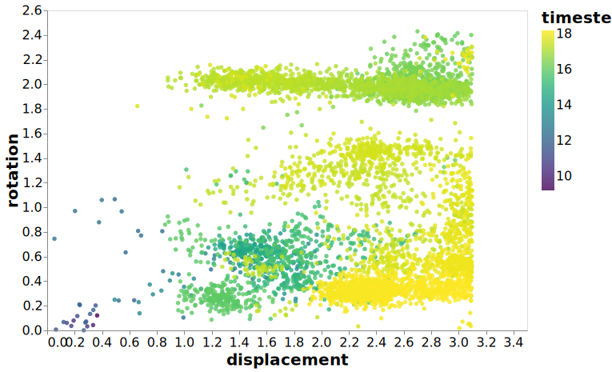

---
jupyter:
  jupytext:
    formats: ipynb,md
    target_format: ipynb,md
    text_representation:
      extension: .md
      format_name: markdown
      format_version: '1.2'
      jupytext_version: 1.3.0
  kernelspec:
    display_name: dynamics
    language: python
    name: dynamics
---

# Stokes-Einstein Breakdown


One of the major results that we observe
is what appears to be a breakdown
in the Stokes-Einstein relationship,
most likely brought about by the reversibility of
the motions that take place.
As a result of this it would be nice to have
a figure that demonstrates this breakdown
with reference to individual particle motions,
since it is the motion of individual particles
that are the cause of this breakdown.

As an individual particle property,
we really only want to follow a smallish number of particles,
probably from a single trajectory.
To have the largest likelihood of
finding something interesting,
I will be using the dynamics from T=1.30, P=13.50.


## Data Ingest/Calculation


I don't have the translations and rotations from
every timepoint saved anywhere,
so I will have to generate all the data
from the trajectories.

```python
from pathlib import Path

import gsd.hoomd
import pandas
import numpy as np

import matplotlib.pyplot as plt
import altair as alt

import sdanalysis
from sdanalysis.dynamics import Dynamics, MolecularRelaxation, LastMolecularRelaxation
from sdanalysis.StepSize import GenerateStepSeries
import sdanalysis
from dynamics_analysis import figures

```

### Loading Data

There are a few differences with the data used for this analysis
due to the different nature of the figures presented.

The file that we are interested in is the dump file which has linear timesteps
rather than the exponential series in the trajectory files.
The reason for the linear series is that we are interested in
following the motion of the particle through many environments,
requiring short steps for all the different environments.
Additionally there is no complication with working out
which of the series that each configuration belongs to.

Along with the trajectory,
I am loading up the dynamics computed previously.
However rather than all the dynamics,
I am only loading up those from the first keyframe.
This is because these are the dynamic quantities that
correspond to the data loaded from the trajectory.

```python
pressure = "13.50"
temperature = "1.30"
directory = Path("../data/simulations/trimer/output/")
# Load up a linear trajectory for ease of analysis
file = directory / f"trajectory-Trimer-P{pressure}-T{temperature}.gsd"
outfile = Path(f"Trimer-13.50-{temperature}.h5")
```

### Computation of Dynamics

The values of the dynamics we have calculated previously
have been using an exponential timescale,
which while great for the more traditional dynamics quantities
becomes unhelpful in computing the molecular quantities
that will be presented in the rest of this document.

I have stored the configuration at a series of linear steps
so the below analysis computes the molecular relaxations
at a single temperature (1.30) using this linear scale,
while also computing the displacement and rotation
at each point in time allowing for the querying of the resulting dataset.

```python
max_steps = None
recompute = False
# Uncomment to recompute quantities this takes a long time to compute
# recompute = True
outfile = Path(f"Trimer-13.50-{temperature}.h5")
if recompute or not outfile.exists():
    dyn = None
    displacements = []
    for frame in sdanalysis.open_trajectory(file):
        if len(frame) == 0:
            continue
        if dyn is None:
            dyn = sdanalysis.dynamics.Dynamics.from_frame(frame)
        dyn.add(frame.position, frame.orientation)
        displacements.append(
            pandas.DataFrame(
                {
                    "timestep": dyn.compute_time_delta(frame.timestep),
                    "time": dyn.compute_time_delta(frame.timestep) * 0.005,
                    "molecule": dyn.get_molid(),
                    "displacement": dyn.compute_displacement(),
                    "rotation": dyn.compute_rotation(),
                }
            )
        )
    disp_df = pandas.concat(displacements)
    disp_df.to_hdf(outfile, "displacements")


with pandas.HDFStore(outfile) as src:
    dyn_df = src.get("dynamics")
    mol_df = src.get("molecular_relaxations")
    df = src.get("displacements")
```

```python
# # Read in pre-computed dynamics properties for a single trajectory
dynamics_df = pandas.read_hdf(
    f"../data/analysis/dynamics/trajectory-Trimer-P13.50-T{temperature}.h5",
    "molecular_relaxations",
).query("keyframe == 0")
# Find the fastest particles
fastest = dynamics_df.sort_values("tau_D").head(5).index.values
slowest = dynamics_df.sort_values("tau_D").tail(5).index.values

# Molecules for selection
selected = fastest
df_fast = df.query("molecule in @selected")
```

```python
df_fast = df_fast.set_index(pandas.TimedeltaIndex(df_fast["timestep"], unit="ns"))
df_fast_groups = df_fast.groupby("molecule").resample("1ms")
```

```python
alt.Chart(df_fast_groups.mean().reset_index(drop=True)).mark_line().encode(
    x="timestep", y="displacement", color="molecule:N"
)
```

```python
mol_id = 120

df_path = df.query("molecule == @mol_id").copy()
df_path = df_path[1:]
df_path.loc[:, "timestep"] = np.log(df_path.loc[:, "timestep"].values)
df_path = df_path[:10_000]

c = (
    alt.Chart(df_path)
    .mark_point(opacity=0.8, filled=True)
    .encode(
        x="displacement",
        y="rotation",
        color=alt.Color("timestep", scale=alt.Scale(scheme="viridis")),
    )
)
with alt.data_transformers.enable("default"):
    c.save("../figures/molecule_trajectory_fast.svg")
```


```python
slowest
```

```python
mol_id = 85

df_path = df.query("molecule == @mol_id").copy()
df_path = df_path[1:]
df_path.loc[:, "timestep"] = np.log(df_path.loc[:, "timestep"].values)
df_path = df_path[:10_000]
c = (
    alt.Chart(df_path)
    .mark_point(opacity=0.8, filled=True)
    .encode(
        x="displacement",
        y="rotation",
        color=alt.Color("timestep", scale=alt.Scale(scheme="viridis")),
    )
)
with alt.data_transformers.enable("default"):
    c.save("../figures/molecule_trajectory_slow.svg")
```




```python
rotations_first = []
rotations_last = []
df_lookup = df.set_index(["timestep", "molecule"])
for molecule, first, last in mol_df.set_index("molecule")[
    ["tau_F", "tau_L"]
].itertuples():
    if last == 2 ** 32 - 1:
        continue
    rotations_first.append(df_lookup.loc[(first, molecule), "rotation"])
    rotations_last.append(df_lookup.loc[(last, molecule), "rotation"])
```

```python
rot_first = np.array(rotations_first)
rot_last = np.array(rotations_last)
rotations = (
    pandas.DataFrame({"First Passage": rot_first})
    .melt()
    .append(pandas.DataFrame({"Last Passage": rot_last}).melt())
)
```

```python
rotations.shape
```

```python
c = (
    alt.Chart(rotations)
    .mark_bar(opacity=0.8)
    .transform_filter(alt.datum.value < 3.1)
    .encode(
        x=alt.X("value:Q", title="Angular Displacement", bin=alt.Bin(maxbins=30)),
        y=alt.Y("count():Q", title="Occurence", stack=None),
        color=alt.Color("variable", title="Time"),
    )
)
c
```
