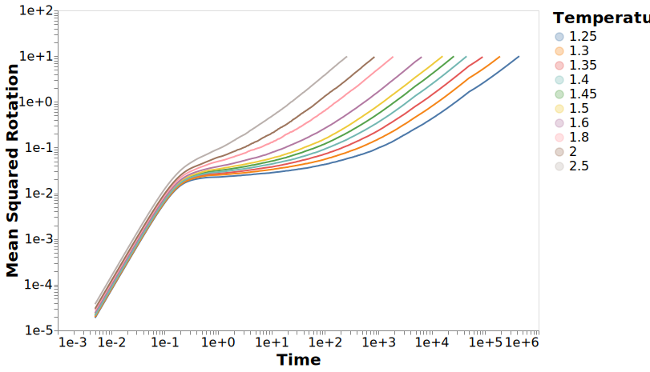
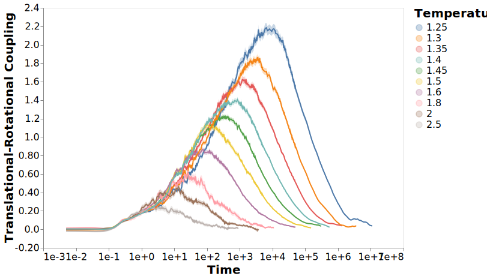
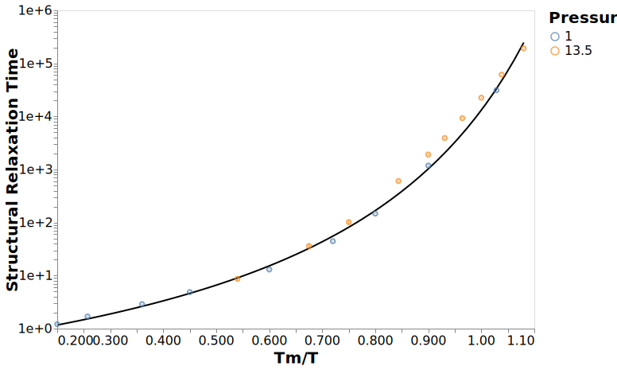
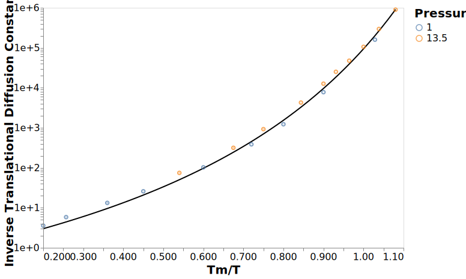

---
jupyter:
  jupytext:
    formats: ipynb,md
    target_format: ipynb,md
    text_representation:
      extension: .md
      format_name: markdown
      format_version: '1.2'
      jupytext_version: 1.5.2
  kernelspec:
    display_name: dynamics
    language: python
    name: dynamics
---

# Dynamics Figures

These are a collection of figures for my PhD thesis.
The naming of the figures will remain consistent throughout and the ordering of the figures should be roughly the same as in the thesis.

```python
# Make dealing with filesystem paths much, much simpler
from pathlib import Path

# Read/write data files and data analysis
import pandas
import numpy as np
import altair as alt
from dynamics_analysis import figures, calc_dynamics, util, vtf

```

This notebook generates a collection of figures
which are exported as svg files
to the `../figures` directory.

## Datasets

The datasets used for the generation of these figures
are found in the `../data/analysis` directory,
with the `dynamics_clean_agg.h5` file containing all the dynamics results in 3 tables

- `dynamics` -> containing the standard raw dynamics quantities including the mean-squared-displacement, structural relaxation, and many others.
    These values include each of these quantities for a number of starting configurations, allowing for the calculation of errors for these quantities.
    For a full list of the available quantities see the [dynamics_interactive notebook](01_dynamics_interactive.ipynb).
- `molecular_relaxations` -> containing the molecular relaxation values for each of the molecules
    allowing comparisons between quantities for a single molecule.
- `relaxations` -> containing the aggregated relaxation value for each of the quantities in the `dynamics` and `molecular_relaxations` tables.
    All these values can be investigated in the [relaxations_interactive notebook](02_relaxations_interactive.ipynb)

```python
# Where the data files with the results are located
data_dir = Path("../data/analysis")

# Load data for most of the figures
dynamics_df = pandas.read_hdf(data_dir / "dynamics_clean_agg.h5", "dynamics")

dynamics_df = dynamics_df.query("pressure == 13.50")
dynamics_df = dynamics_df.sort_values("time")

# Output path for all figures
figure_dir = Path("../figures")
# Ensure the directory exists
figure_dir.mkdir(exist_ok=True)
```

## Comparative Dynamics

These are a collection of dynamics quantities
to establish that the system we are dealing with
has behaviour that aligns with much of the literature.

### Mean Squared Displacement

The mean squared displacement is a long timescale look at the translational motion.
There are three main sections to the motion, the initial ballistic motion,
which has a slope of 2.
This is before the particles have collided and so are able to move freely.
Beyond this timescale the particles start to collide,
which results in temperature dependent behaviour.
At low temperatures,
we see a plateau region,
which is typically described as a timescale over which particles
are trapped in their local environment also known as the cage.
At higher temperatures there is sufficient energy to escape
going directly to the third region,
which is the diffusive regime.
This final region is where the particles
are undergoing Brownian motion,
and the motion can be described by small random jumps.

```python
c = figures.plot_dynamics(
    dynamics_df, "msd", title="Mean Squared Displacement", scale="log"
)
x=np.linspace(1e-2, 1, 5)
df = pandas.DataFrame({"x2": x, "y2": x**2, "x": x*2e7, "y": x*50})
c2 = alt.Chart(df).encode(x="x").mark_line(color="black")
c = c + c2.encode(x="x2", y="y2") + c2.encode(x="x", y="y")

with alt.data_transformers.enable("default"):
    c.save(str(figure_dir / "mean_squared_displacement.svg"), webdriver="firefox")
c
```


The behaviour of the mean-squared-rotation,
is equivalent to that of the mean-squared-displacement,
showing the same regions,
albeit at different time and length scales.

```python
c = figures.plot_dynamics(
    dynamics_df, "msr", title="Mean Squared Rotation", scale="log"
).transform_filter(alt.datum.msr_mean < 10)

with alt.data_transformers.enable("default"):
    c.save(str(figure_dir / "mean_squared_rotation.svg"), webdriver="firefox")
```




### Non-Gaussian

A result of the plateau region in the MSD
is that there are particles which are fast escaping their cage,
while other particles are very slow.
This leads to heterogeneous dynamics,
that is, regions of fast and slow dynamics within a configuration.
One of the measures of the heterogeneity
within a simulation is the non-Gaussian parameter $\alpha$
given by

$ \alpha = \frac{\langle \Delta \vec{r}^4 \rangle}{\langle \Delta \vec{r}^2 \rangle^2} - 1 $

This parameter provides information on both
the size, and
the timescale
of the heterogeneity of the dynamics.
A value of 0 indicates that the distribution of the dynamics
is perfectly Gaussian,
while larger values indicate a deviation from Gaussian.

```python
c = figures.plot_dynamics(dynamics_df, "alpha", title="Non-Gaussian")

with alt.data_transformers.enable("default"):
    c.save(str(figure_dir / "non_gaussian.svg"), webdriver="firefox")
```


As the temperature drops,
the non-Gaussian behaviour increases in magnitude and timescale.
This results re-enforces the idea that the heterogeneous dynamics
are represented by the plateau region in the MSD.

The same approach can be applied to the rotational dynamics
which displays similar behaviour.
The most notable difference
is the sharp peal that occurs in the rotational non-Gaussian,
in addition to the 'master curve',
where all temperatures share the start and branch off at different times.


```python
c = figures.plot_dynamics(dynamics_df, "alpha_rot", title="Rotational Non-Gaussian")

with alt.data_transformers.enable("default"):
    c.save(str(figure_dir / "rotational_alpha.svg"), webdriver="firefox")
```


### Structural Relaxation

The structural relaxation is a fundamental quantity of dynamics
describing the short timescale motions associated with viscosity.
The typical measure of structural relaxation is through the
intermediate scattering function
the calculation of which is described in <06_computing_structural_relaxation>.
This relaxation is chosen since it is experimentally measurable
using neutron scattering.

```python
c = figures.plot_dynamics(
    dynamics_df, "scattering_function", title="Intermediate Scattering Function"
)

with alt.data_transformers.enable("default"):
    c.save(str(figure_dir / "scattering_function.svg"), webdriver="firefox")
```


A simpler measure of structural relaxation
is to count the fraction of particles
which are more than a specified distance from their initial positions.
With the standard distance being the characteristic distance of
the wave number from the intermediate scattering function.
This generates a curve very similar to the intermediate scattering function,
while also being able to attribute relaxation to each particle.

```python
c = figures.plot_dynamics(dynamics_df, "struct", title="Structural Relaxation")

with alt.data_transformers.enable("default"):
    c.save(str(figure_dir / "structural_relaxation.svg"), webdriver="firefox")
```


### Rotational Relaxation

The rotational relaxation function $C_l$ is another quantity of interest,
although it is typically calculated as a dipole relaxation

$ C_l = \langle \hat{\vect{u}}(0) \cdot \hat{\vect{u}}(t) \rangle

where $\hat\vect{u}$ is the unit vector representing
the orientation of a dipole at a point in time.
The reason it is a dipole is that
it is unable to capture the rotations
around the axis of the vector,
although for 2D this distinction is not present.

```python
c = figures.plot_dynamics(dynamics_df, "rot2", title="Rotational Relaxation")

with alt.data_transformers.enable("default"):
    c.save(str(figure_dir / "rotational_relaxation.svg"), webdriver="firefox")
```


The rotational relaxation takes place as a two-step process,
just like the diffusion,
with the initial relaxation to a plateau
followed by more complete relaxation.
This can be described by the KWW stretched exponential.

## Rotational and Translational Coupling

The rotational-translational coupling,
is a concept derived from the non-Gaussian,
including the contributions from both
the rotational and translational motion.
The coupling factor $\gamma$ is given by

$ \gamma = \frac{\langle \Delta \vec{r}^2 \Delta \theta^2 \rangle}
{\langle \Delta \vec{r}^2 \rangle\langle \vec{\theta}^2 \rangle} - 1 $

and shows very similar behaviour to
both the rotational and translational non-Gaussian parameters.
This indicates that where particles are mobile,
they are mobile in both translational and rotational motion.

```python
c = figures.plot_dynamics(
    dynamics_df, "gamma", title="Translational-Rotational Coupling"
)

with alt.data_transformers.enable("default"):
    c.save(str(figure_dir / "gamma.svg"), webdriver="firefox")
```




## Relaxation Quantities

As a method of evaluating the relaxation timescales,
I am using the Vogel-Tamman-Fulcher relation

$ \tau_\alpha = \tau_0 \exp\left[\frac{DT_0}{T-T_0}\right] $

which can be fit to the existing dynamics.
Once the values of $\tau_0$, $T_0$, and $D$
have been determined from the fit,
it is possible to extrapolate the glass transition temperature $T_g$
along with the fragility.
The glass transition temperature
is the temperature at which the relaxation time $\tau_\alpha$
is predicted to exceed a time of $10^{14}$.
While the fragility $m$ is extracted from the differentiation

$ m = \frac{d \log \tau}{d T_g / T} \right\vert_{T=T_g} $

This analysis is based off that from @Meenakshisundaram2019

### Data

The data is within the file `../data/analysis/dynamics_clean_agg.h5`
under the `'relaxations'` table.
To ensure good fitting of the data,
only values with a normalised temperature above 1.2
are included in the analysis.

```python
relaxations_df = pandas.read_hdf(data_dir / "dynamics_clean_agg.h5", "relaxations")
# Remove the lowest temperature data
relaxations_df = relaxations_df.query("inv_temp_norm < 1.2")
```

### Structural Relaxation

The intermediate scattering function is
the standard measure of structural relaxation,
so we investigate the relaxation times here.

```python
c = figures.plot_relaxations(
    relaxations_df, "scattering_function", title="Structural Relaxation Time", fit=True
)

with alt.data_transformers.enable("default"):
    c.save(str(figure_dir / "scattering_function_summary.svg"), webdriver="firefox")
```


Most notable about the structural relaxation time
is the fragility, being the degree to which the curve is non-linear.
It is possible to extrapolate this curve to a relaxation time of 1e14,
the timescale of the glass transition.
From this we can extract both the glass transition temperature
and the fragility of the material.

```python
glass_transition, fragility = vtf.find_glass_transition_fragility(
    relaxations_df["inv_temp_norm"],
    relaxations_df["scattering_function_mean"],
    errors=relaxations_df["scattering_function_sem"],
)
print(
    f"""The glass transition temperature at P=13.50 is {1/glass_transition * 1.35}
and at P=1.00 {1/glass_transition * 0.36}.
The fragility is {fragility}."""
)
```

The fragility observed is in excess of 200,
which makes it a highly fragile liquid.
Also of note is that the glass transition temperature $T_g$
is well below the current temperatures studied,
meaning the dynamic heterogeneities have an onset well above 1.2 $T_g$.

The same analysis can be performed with the
individual particle structural relaxation time.
This analysis gives much the same result as
the intermediate scattering function.

```python
c2 = figures.plot_relaxations(
    relaxations_df, "struct", title="Structural Relaxation Time", fit=True
)

with alt.data_transformers.enable("default"):
    c2.save(str(figure_dir / "structural_relaxation_summary.svg"), webdriver="firefox")
```



```python
glass_transition, fragility = vtf.find_glass_transition_fragility(
    relaxations_df["inv_temp_norm"],
    relaxations_df["struct_mean"],
    errors=relaxations_df["struct_sem"],
)
print(
    f"""The glass transition temperature at P=13.50 is {1/glass_transition * 1.35}
and at P=1.00 {1/glass_transition * 0.36}.
The fragility is {fragility}."""
)
```

### Diffusion

The inverse diffusion constant
can also be considered a relaxation time
and is studied as such.

```python
c = figures.plot_relaxations(
    relaxations_df,
    "inv_diffusion",
    title="Inverse Translational Diffusion Constant",
    fit=True,
)

with alt.data_transformers.enable("default"):
    c.save(str(figure_dir / "diffusion_constant_summary.svg"), webdriver="firefox")
```



```python
glass_transition, fragility = vtf.find_glass_transition_fragility(
    relaxations_df["inv_temp_norm"],
    relaxations_df["inv_diffusion_mean"],
    errors=relaxations_df["inv_diffusion_sem"],
)
print(
    f"""The glass transition temperature at P=13.50 is {1/glass_transition * 1.35}
and at P=1.00 {1/glass_transition * 0.36}.
The fragility is {fragility}."""
)
```

Notable about the diffusive relaxation
is the fragility is significantly less
than the structural relaxation,
being about half the value.
This smaller fragility is also observed
with the rotational diffusion.

```python
c = figures.plot_relaxations(
    relaxations_df, "inv_diffusion_rot", title="1/D_r", fit=True
)

with alt.data_transformers.enable("default"):
    c.save(str(figure_dir / "rot_diffusion_summary.svg"), webdriver="firefox")
```


```python
glass_transition, fragility = vtf.find_glass_transition_fragility(
    relaxations_df["inv_temp_norm"],
    relaxations_df["inv_diffusion_rot_mean"],
    errors=relaxations_df["inv_diffusion_rot_sem"],
)
print(
    f"""The glass transition temperature at P=13.50 is {1/glass_transition * 1.35}
and at P=1.00 {1/glass_transition * 0.36}.
The fragility is {fragility}."""
)
```

### Rotational Relaxation

The rotation associated with the second Legendre polynomial
is normally accessed in simulations
so it is the rotational relaxation quantity I am presenting.

```python
c = figures.plot_relaxations(
    relaxations_df, "rot2", title="Rotational Relaxation", fit=True
)

with alt.data_transformers.enable("default"):
    c.save(str(figure_dir / "rotational_relaxation_summary.svg"), webdriver="firefox")
```


```python
glass_transition, fragility = vtf.find_glass_transition_fragility(
    relaxations_df["inv_temp_norm"],
    relaxations_df["rot2_mean"],
    errors=relaxations_df["rot2_sem"],
)
print(
    f"""The glass transition temperature at P=13.50 is {1/glass_transition * 1.35}
and at P=1.00 {1/glass_transition * 0.36}.
The fragility is {fragility}."""
)
```

It is rather puzzling that this has a fragility
between that of the structural relaxation and the diffusion.
Maybe the first order polynomial is able to provide some more insight.

```python
glass_transition, fragility = vtf.find_glass_transition_fragility(
    relaxations_df["inv_temp_norm"],
    relaxations_df["rot1_mean"],
    errors=relaxations_df["rot1_sem"],
)
print(
    f"""The glass transition temperature at P=13.50 is {1/glass_transition * 1.35}
and at P=1.00 {1/glass_transition * 0.36}.
The fragility is {fragility}."""
)
```

Here it seems the degree of fragility is affected by the timescale
over which we take a measurement.
The structural relaxation is over the shortest timescale
and it has the largest fragility.
The diffusion constants, both rotational and translational
both have the smallest fragilities
and are associated with the longest timescales.
The rotational relaxations are in the middle
with $C_2$ having a slightly larger fragility,
which makes sense here as it has the shorter relaxation distance.

## Heterogeneities

```python
c = figures.plot_relaxations(
    relaxations_df, "alpha", title="Rotational Relaxation", fit=True
)

with alt.data_transformers.enable("default"):
    c.save(str(figure_dir / "alpha_relaxation_summary.svg"), webdriver="firefox")
c
```

## Demonstration of Dynamic Heterogeneities

```python
from sdanalysis import open_trajectory
from sdanalysis.dynamics import Dynamics
import matplotlib.pyplot as plt
```

```python
temperature = 1.40
pressure = 13.50
alpha_time = relaxations_df.set_index(["pressure", "temperature"]).loc[
    (13.50, 1.40), "gamma_mean"
]

frame_iterator = open_trajectory(
    f"../data/simulations/trimer/output/trajectory-Trimer-P{pressure:.2f}-T{temperature:.2f}.gsd"
)

dyn = Dynamics.from_frame(next(frame_iterator))
for frame in frame_iterator:
    if frame.timestep * 0.005 > alpha_time:
        break
    dyn.add_frame(frame)
```

```python
df_hetero = pandas.DataFrame(
    {
        "x": frame.x_position,
        "y": frame.y_position,
        "disp_x": dyn.delta_translation[:, 0],
        "disp_y": dyn.delta_translation[:, 1],
        "rot_disp": np.power(dyn.compute_rotation(), 0.3),
    }
)
```

```python
fig, ax = plt.subplots()
ax.scatter("x", "y", c="rot_disp", data=df_hetero, cmap="Blues")
ax.quiver("x", "y", "disp_x", "disp_y", data=df_hetero)
ax.set_frame_on(False)
ax.set_xticks([])
ax.set_yticks([])
fig.savefig("../figures/heterogeneities.svg")
```
