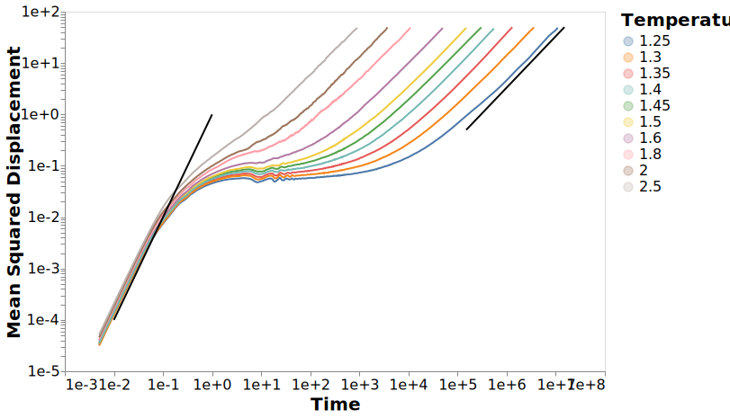

---
jupyter:
  jupytext:
    formats: ipynb,md
    target_format: ipynb,md
    text_representation:
      extension: .md
      format_name: markdown
      format_version: '1.1'
      jupytext_version: 1.2.4
  kernelspec:
    display_name: dynamics
    language: python
    name: dynamics
---

# Dynamics Figures

These are a collection of figures for my PhD thesis.
The naming of the figures will remain consistent throughout and the ordering of the figures should be roughly the same as in the thesis.

```python
# Make dealing with filesystem paths much, much simpler
from pathlib import Path

# Read/write data files and data analysis
import pandas
import numpy as np
import altair as alt
from dynamics_analysis import figures, calc_dynamics

```

This notebook generates a collection of figures which are exported as pdf files to the `../figures/thesis` directory.
To prevent the figures from being saved, only outputting the resulting files to this notebook
you can set the `save_figures` variable to `False`.

```python
save_figures = True
# save_figures = False
```

## Datasets

The datasets used for the generation of these figures are found in the `../data/analysis` directory,
with the `dynamics.h5` file containing all the dynamics results in 3 tables

- `dynamics` -> containing the standard raw dynamics quantities including the mean-squared-displacement, structural relaxation, and many others.
    These values include each of these quantities for a number of starting configurations, allowing for the calculation of errors for these quantities.
    For a full list of the available quantities see the [dynamics_interactive notebook](01_dynamics_interactive.ipynb).
- `molecular_relaxations` -> containing the molecular relaxation values for each of the molecules
    allowing comparisons between quantities for a single molecule.
- `relaxations` -> containing the aggregated relaxation value for each of the quantities in the `dynamics` and `molecular_relaxations` tables.
    All these values can be investigated in the [relaxations_interactive notebook](02_relaxations_interactive.ipynb)


```python
# Where the data files with the results are located
data_dir = Path("../data/analysis")

# Load data for most of the figures
dynamics_df = pandas.read_hdf(data_dir / "dynamics_clean_agg.h5", "dynamics")

dynamics_df = dynamics_df.query("pressure == 13.50")
dynamics_df = dynamics_df.sort_values("time")

# Output path for all figures
figure_dir = Path("../figures")
# Ensure the directory exists
figure_dir.mkdir(exist_ok=True)
```

## Comparative Dynamics

These are a collection of dynamics quantities to establish that the system we are dealing with has behaviour that more or less aligns with much of the literature.

### Mean Squared Displacement

```python
c = figures.plot_dynamics(dynamics_df, "msd", title="Mean Squared Displacement", scale="log")

if save_figures:
    with alt.data_transformers.enable("default"):
        c.save(str(figure_dir / "mean_squared_displacement.svg"), webdriver="firefox")
```




## Non-gaussian

```python
c = figures.plot_dynamics(dynamics_df, "alpha", title="Non Gaussian")

if save_figures:
    with alt.data_transformers.enable("default"):
        c.save(str(figure_dir / "non_gaussian.svg"), webdriver="firefox")
```


## Structural Relaxation

```python
c = figures.plot_dynamics(dynamics_df, "struct", title="Structrual Relaxation")

if save_figures:
    with alt.data_transformers.enable("default"):
        c.save(str(figure_dir / "structural_relaxation.svg"), webdriver="firefox")
```


```python
c = figures.plot_dynamics(
    dynamics_df, "scattering_function", title="Intermediate Scattering Function"
)

if save_figures:
    with alt.data_transformers.enable("default"):
        c.save(str(figure_dir / "scattering_function.svg"), webdriver="firefox")
```


## Rotational Relaxation

```python
c = figures.plot_dynamics(dynamics_df, "rot2", title="Rotational Relaxation")

if save_figures:
    with alt.data_transformers.enable("default"):
        c.save(str(figure_dir / "rotational_relaxation.svg"), webdriver="firefox")
```


## Relaxation Quantities

```python
relaxations_df = pandas.read_hdf(data_dir / "dynamics_clean_agg.h5", "relaxations")
# relaxations_df = relaxations_df.query("pressure == 13.50")
relaxations_df[relaxations_df < 0] = np.NaN
```

```python
relaxations_df.columns
```

### Scattering Function

```python
c = figures.plot_relaxations(relaxations_df, "scattering_function")

if save_figures:
    with alt.data_transformers.enable("default"):
        c.save(str(figure_dir / "scattering_function_summary.svg"), webdriver="firefox")
```


```python
c2 = c + figures.plot_relaxations(relaxations_df, "struct", title="Structural Relaxation")

if save_figures:
    with alt.data_transformers.enable("default"):
        c2.save(
            str(figure_dir / "structural_relaxation_summary.svg"), webdriver="firefox"
        )
```


### Diffusion

```python
c = figures.plot_relaxations(relaxations_df, "inv_diffusion", title="1/D")

if save_figures:
    with alt.data_transformers.enable("default"):
        c.save(str(figure_dir / "diffusion_constant_summary.svg"), webdriver="firefox")
```


### Rotational Relaxation

```python
c = figures.plot_relaxations(relaxations_df, "rot2", title="Rotational Relaxation")

if save_figures:
    with alt.data_transformers.enable("default"):
        c.save(
            str(figure_dir / "rotational_relaxation_summary.svg"), webdriver="firefox"
        )
```


## Molecular Relaxations

```python
mol_df = pandas.read_hdf(data_dir / "dynamics_clean_agg.h5", "molecular_relaxations")
```

```python
relax_df = (
    relaxations_df.set_index(["temperature", "pressure", "inv_temp_norm"])
    .join(mol_df.set_index(["temperature", "pressure", "inv_temp_norm"]))
    .reset_index()
)
```

```python
mol_df.head()
```

```python
comp_relax_df = figures.reshape_dataframe(relax_df)
```

```python
comp_relax_df.variable.unique()
```

```python
figures.plot_relaxations(mol_df, "tau_F")
```

```python
figures.plot_multi_relaxations(
    comp_relax_df, ["tau_F", "scattering_function"], title="Molecular"
)
```

```python
comp_relax_df.variable.unique()
```

```python
figures.plot_multi_relaxations(comp_relax_df, ["rot1", "rot2"])
```

```python
figures.plot_multi_relaxations(comp_relax_df, ["inv_diffusion", "tau_D"])
```
