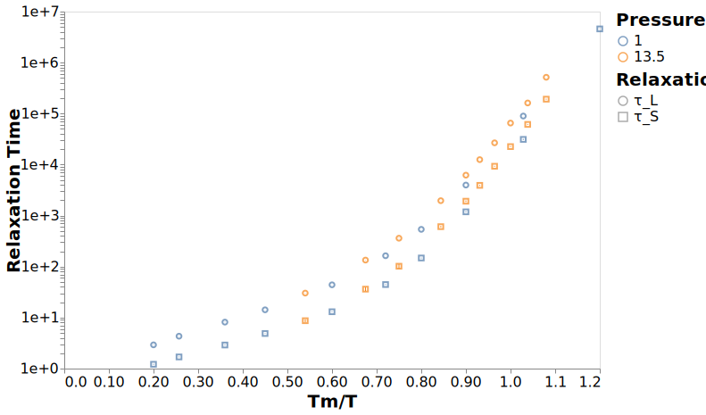

---
jupyter:
  jupytext:
    formats: ipynb,md
    target_format: ipynb,md
    text_representation:
      extension: .md
      format_name: markdown
      format_version: '1.2'
      jupytext_version: 1.3.0
  kernelspec:
    display_name: dynamics
    language: python
    name: dynamics
---

# Molecular Relaxations

```python
# Make dealing with filesystem paths much, much simpler
from pathlib import Path

# Read/write data files and data analysis
import pandas
import numpy as np
import altair as alt
from dynamics_analysis import figures, calc_dynamics
```

```python
# Where the data files with the results are located
data_dir = Path("../data/analysis")

# Output path for all figures
figure_dir = Path("../figures")
# Ensure the directory exists
figure_dir.mkdir(exist_ok=True)

# Load data for most of the figures
df_relax = pandas.read_hdf(data_dir / "dynamics_clean_agg.h5", "relaxations")
df_mol = pandas.read_hdf(data_dir / "dynamics_clean_agg.h5", "molecular_relaxations")

df = (
    df_relax.set_index(["temperature", "pressure", "inv_temp_norm"])
    .join(df_mol.set_index(["temperature", "pressure", "inv_temp_norm"]))
    .reset_index()
)

df_melt = figures.reshape_dataframe(df)
```

## Structural Relaxation Analog

```python
c = figures.plot_multi_relaxations(
    df_melt, ["tau_F", "struct"], title="Relaxation Time"
)
with alt.data_transformers.enable("default"):
    c.save("../figures/first_passage_time.svg", webdriver="firefox")
```


```python
c = figures.plot_multi_relaxations(
    df_melt, ["tau_L", "struct"], title="Relaxation Time"
)
with alt.data_transformers.enable("default"):
    c.save("../figures/last_passage_time.svg", webdriver="firefox")
```




## Diffusion Analog

```python
c = figures.plot_multi_relaxations(
    df_melt, ["tau_D", "inv_diffusion"], title="Relaxation Time"
)
with alt.data_transformers.enable("default"):
    c.save("../figures/diffusive_time.svg", webdriver="firefox")
```


## Rotational Relaxation Analog

```python
c = figures.plot_multi_relaxations(
    df_melt, ["tau_T4", "rot2"], title="Relaxation Time"
)
with alt.data_transformers.enable("default"):
    c.save("../figures/rotational_time.svg", webdriver="firefox")
```


## Summary

```python
df_relax = df.set_index(["pressure", "inv_temp_norm"]).sort_index()

df_ratios = pandas.DataFrame({
    "D_tau_D": df_relax["inv_diffusion_mean"] / df_relax["tau_D_mean"],
#     "tau_S_tau_F": df_relax["struct_mean"] / df_relax["tau_F_mean"],
    "tau_S_tau_L": df_relax["struct_mean"] / df_relax["tau_L_mean"],
    "rot1_tau_T2": df_relax["rot1_mean"] / df_relax["tau_T2_mean"],
    "rot2_tau_T4": df_relax["rot2_mean"] / df_relax["tau_T4_mean"],
}).reset_index().melt(id_vars=["pressure", "inv_temp_norm"])
```

```python
c = alt.Chart(df_ratios).mark_point().encode(x="inv_temp_norm", y="value", color="variable", shape="variable")

with alt.data_transformers.enable("default"):
    c.save("../figures/ratio_comparison.svg", webdriver="firefox")
```


