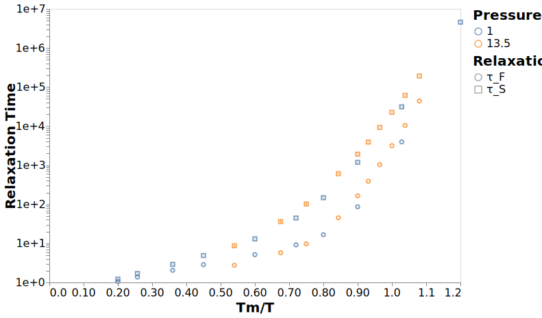
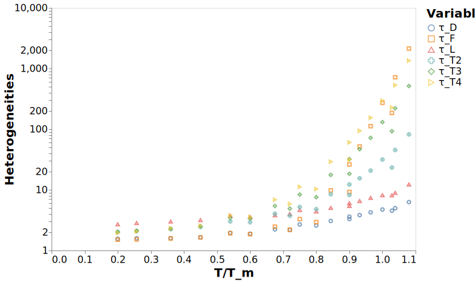

---
jupyter:
  jupytext:
    formats: ipynb,md
    target_format: ipynb,md
    text_representation:
      extension: .md
      format_name: markdown
      format_version: '1.2'
      jupytext_version: 1.3.3
  kernelspec:
    display_name: dynamics
    language: python
    name: dynamics
---

# Molecular Relaxations

```python
# Make dealing with filesystem paths much, much simpler
from pathlib import Path

# Read/write data files and data analysis
import pandas
import numpy as np
import altair as alt
from dynamics_analysis import figures, calc_dynamics
```

```python
# Where the data files with the results are located
data_dir = Path("../data/analysis")

# Output path for all figures
figure_dir = Path("../figures")
# Ensure the directory exists
figure_dir.mkdir(exist_ok=True)

# Load data for most of the figures
df_relax = pandas.read_hdf(data_dir / "dynamics_clean_agg.h5", "relaxations")
df_mol = pandas.read_hdf(data_dir / "dynamics_clean_agg.h5", "molecular_relaxations")

df = (
    df_relax.set_index(["temperature", "pressure", "inv_temp_norm"])
    .join(df_mol.set_index(["temperature", "pressure", "inv_temp_norm"]))
    .reset_index()
)

df_melt = figures.reshape_dataframe(df)
```

## Structural Relaxation Analog

```python
c = figures.plot_multi_relaxations(
    df_melt,
    ["tau_F", "struct"],
    title="Relaxation Time",
    replace={"tau_F": "τ_F", "struct": "τ_S"},
)
with alt.data_transformers.enable("default"):
    c.save("../figures/first_passage_time.svg", webdriver="firefox")
```



```python
c = figures.plot_multi_relaxations(
    df_melt,
    ["tau_L", "struct"],
    title="Relaxation Time",
    replace={"tau_L": "τ_L", "struct": "τ_S"},
)
with alt.data_transformers.enable("default"):
    c.save("../figures/last_passage_time.svg", webdriver="firefox")
```


## Diffusion Analog

```python
c = figures.plot_multi_relaxations(
    df_melt,
    ["tau_D", "inv_diffusion"],
    title="Relaxation Time",
    replace={"tau_D": "τ_D", "inv_diffusion": "1/D"},
)
with alt.data_transformers.enable("default"):
    c.save("../figures/diffusive_time.svg", webdriver="firefox")
```


## Rotational Relaxation Analog

```python
c = figures.plot_multi_relaxations(
    df_melt,
    ["tau_T4", "rot2"],
    title="Relaxation Time",
    replace={"tau_T4": "τ_T4", "rot2": "τ_2"},
)
with alt.data_transformers.enable("default"):
    c.save("../figures/rotational_time.svg", webdriver="firefox")
```


## Summary

```python
df_relax = df.set_index(["pressure", "inv_temp_norm"]).sort_index()

df_ratios = (
    pandas.DataFrame(
        {
            "D/τ_D": df_relax["inv_diffusion_mean"] / df_relax["tau_D_mean"],
            #     "tau_S_tau_F": df_relax["struct_mean"] / df_relax["tau_F_mean"],
            "τ_S/τ_L": df_relax["struct_mean"] / df_relax["tau_L_mean"],
            "τ_R1, τ_T2": df_relax["rot1_mean"] / df_relax["tau_T2_mean"],
            "τ_R2, τ_T4": df_relax["rot2_mean"] / df_relax["tau_T4_mean"],
        }
    )
    .reset_index()
    .melt(id_vars=["pressure", "inv_temp_norm"])
)
```

```python
c = (
    alt.Chart(df_ratios)
    .mark_point()
    .encode(
        x=alt.X("inv_temp_norm",title="Tm/T"), 
        y=alt.Y("value", title="Ratio"), 
        color=alt.Color("variable", title="Quantity"), 
        shape="variable"
    )
)

with alt.data_transformers.enable("default"):
    c.save("../figures/ratio_comparison.svg", webdriver="firefox")
```


## Heterogeneities

```python
df_temp = df_mol.set_index(["temperature", "pressure", "inv_temp_norm"])
df_hetero = (
    pandas.DataFrame(
        {
            "τ_D": df_temp["tau_D_mean"] * df_temp["tau_D_inv_mean"],
            "τ_F": df_temp["tau_F_mean"] * df_temp["tau_F_inv_mean"],
            "τ_L": df_temp["tau_L_mean"] * df_temp["tau_L_inv_mean"],
            "τ_T2": df_temp["tau_T2_mean"] * df_temp["tau_T2_inv_mean"],
            "τ_T3": df_temp["tau_T3_mean"] * df_temp["tau_T3_inv_mean"],
            "τ_T4": df_temp["tau_T4_mean"] * df_temp["tau_T4_inv_mean"],
        }
    )
    .reset_index()
    .melt(id_vars=["temperature", "pressure", "inv_temp_norm"])
)
```

```python
c = (
    alt.Chart(df_hetero)
    .mark_point()
    .encode(
        x=alt.X("inv_temp_norm", title="T/T_m"),
        y=alt.Y("value", title="Heterogeneities", scale=alt.Scale(type="log")),
        color=alt.Color("variable", title="Variable"),
        shape="variable",
    )
)
with alt.data_transformers.enable("default"):
    c.save("../figures/molecular_heterogeneities.svg", webdriver="firefox")
```




## Distribution of timescales

```python
df_mol_dist = (
    pandas.read_hdf(data_dir / "dynamics_clean.h5", "molecular_relaxations")
    .set_index(["pressure", "temperature"])
    .sort_index()
)
```

```python
df_hist = (df_mol_dist.loc[(13.50, 1.40), "tau_L"].reset_index(drop=True)).to_frame()
```

```python
c = (
    alt.Chart(df_hist)
    .mark_bar()
    .encode(
        x=alt.X("tau_L", title="τ_L", bin=alt.Bin(maxbins=100)),
        y=alt.Y("count()", title="Frequency"),
    )
    .transform_filter(alt.datum.tau_L > 0)
)

with alt.data_transformers.enable("default"):
    c.save("../figures/histogram_last_passage.svg", webdriver="firefox")
```


```python
df_mol_coupling = df_mol_dist.loc[
    (13.50, 1.40),
]
```

```python
df_first = df_mol_coupling.apply(lambda x: x < df_mol_coupling["tau_F"]).assign(
    time="first"
)
df_last = df_mol_coupling.apply(lambda x: x < df_mol_coupling["tau_L"]).assign(
    time="last"
)
df_prop = pandas.concat([df_first, df_last]).reset_index()
```

```python
df_plot = (
    df_prop.melt(
        id_vars=["time", "temperature"], value_vars=["tau_T2", "tau_T3", "tau_T4"]
    )
    .groupby(["time", "temperature", "variable"])
    .mean()
    .reset_index()
    .replace(
        {
            "first": "τ_F",
            "last": "τ_L",
            "tau_T2": "τ_T2",
            "tau_T3": "τ_T3",
            "tau_T4": "τ_T4",
        }
    )
)
```

```python
c = (
    alt.Chart(df_plot[::-1])
    .mark_bar()
    .encode(
        x=alt.X(
            "variable",
            title="Rotational Relaxation",
            axis=alt.Axis(labelAngle=0),
            sort=None,
        ),
        y=alt.Y("value", title="Fraction Relaxed", scale=alt.Scale(domain=(0.0, 1))),
        column=alt.Column("time", title="Translational Time"),
        color=alt.Color("variable:N", title="Rotational Relaxation", legend=None),
    )
    .properties(width=300)
)
c
```

```python
with alt.data_transformers.enable("default"):
    c.save("../figures/rotational_displacement.svg", webdriver="firefox")
```
