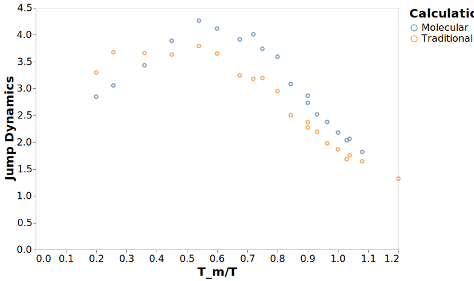

---
jupyter:
  jupytext:
    formats: ipynb,md
    text_representation:
      extension: .md
      format_name: markdown
      format_version: '1.2'
      jupytext_version: 1.3.0
  kernelspec:
    display_name: dynamics
    language: python
    name: dynamics
---

# Understanding Jump Dynamics

```python
# Make dealing with filesystem paths much, much simpler
from pathlib import Path

# Read/write data files and data analysis
import pandas
import numpy as np
import altair as alt
from dynamics_analysis import figures, calc_dynamics, util
```

```python
# Where the data files with the results are located
data_dir = Path("../data/analysis")

# Load data for most of the figures
dynamics_df = pandas.read_hdf(data_dir / "dynamics_clean_agg.h5", "dynamics")

dynamics_df = dynamics_df.query("pressure == 13.50")
dynamics_df = dynamics_df.sort_values("time")


relaxations_df = pandas.read_hdf(data_dir / "dynamics_clean_agg.h5", "relaxations")
relaxations_df[relaxations_df < 0] = np.NaN

df_mol = pandas.read_hdf(data_dir / "dynamics_clean_agg.h5", "molecular_relaxations")

# Output path for all figures
figure_dir = Path("../figures")
# Ensure the directory exists
figure_dir.mkdir(exist_ok=True)
```

## Rotational Jumps

```python
relaxations_df.columns
```

```python
index = ["temperature", "pressure", "inv_temp_norm"]
df_temp = relaxations_df.set_index(index).join(df_mol.set_index(index))
df_ratio = pandas.DataFrame(
    {
        "Traditional": df_temp["rot1_mean"] / df_temp["rot2_mean"],
        #     "tau1/tau2_sem":  df_temp["rot2_sem"] / df_temp["rot2_mean"] + df_temp["rot1_sem"] / df_temp["rot2_mean"],
        "Molecular": df_temp["tau_T2_mean"] / df_temp["tau_T4_mean"],
        #     "tau_T2/tau_T4_sem":  df_temp["tau_T2_sem"] / df_temp["tau_T2_mean"] + df_temp["tau_T4_sem"] / df_temp["tau_T4_mean"],
    }
).reset_index()
# df_ratio["tau1/tau2_sem"] *= df_ratio["tau1/tau2_mean"]
# df_ratio["tau_T2/tau_T4_sem"] *= df_ratio["tau_T2/tau_T4_mean"]
```

```python
df_ratios = df_ratio.melt(id_vars=index)
```

```python
c = alt.Chart(df_ratios).encode(x="inv_temp_norm", y="value", color="variable")
c = c.mark_point() + c.mark_errorbar()

with alt.data_transformers.enable("default"):
    c.save("../figures/rotational_jumps.svg", webdriver="firefox")
```



```python
df_mol

df_temp = df_mol.set_index(["temperature", "pressure", "inv_temp_norm"])
df_ratio = pandas.DataFrame(
    {
        "tau_T2/tau_T4_mean": df_temp["tau_T2_mean"] / df_temp["tau_T4_mean"],
        "tau_T2/tau_T4_sem": df_temp["tau_T2_sem"] / df_temp["tau_T2_mean"]
        + df_temp["tau_T4_sem"] / df_temp["tau_T4_mean"],
        "tau_D/tau_L_mean": df_temp["tau_D_mean"] / df_temp["tau_L_mean"],
        "tau_D/tau_L_sem": df_temp["tau_L_sem"] / df_temp["tau_L_mean"]
        + df_temp["tau_D_sem"] / df_temp["tau_D_mean"],
    }
).reset_index()
df_ratio["tau_T2/tau_T4_sem"] *= df_ratio["tau_T2/tau_T4_mean"]
df_ratio["tau_D/tau_L_sem"] *= df_ratio["tau_D/tau_L_mean"]
```

```python
c = alt.Chart(df_ratio).encode(
    x="inv_temp_norm", y="tau_T2/tau_T4_mean", yError="tau_T2/tau_T4_sem"
)
c = c.mark_point() + c.mark_errorbar()

with alt.data_transformers.enable("default"):
    c.save("../figures/tauT2_tauT4_mean.svg", webdriver="firefox")
```

```python
c
```

```python
c = alt.Chart(df_ratio).encode(
    x="inv_temp_norm", y="tau_D/tau_L_mean", yError="tau_D/tau_L_sem"
)
c = c.mark_point() + c.mark_errorbar()
c
```

```python
relaxations_df
```

## Breakdown in Stokes Einstein

```python
df_temp = relaxations_df.set_index(index)
df_stokes = (
    pandas.DataFrame(
        {
            "D_t/D_r": df_temp["msd_mean"] / df_temp["msr_mean"],
            "D_t_tau_r1": df_temp["msd_mean"] * df_temp["rot2_mean"],
        }
    )
    .reset_index()
    .melt(id_vars=index)
)

alt.Chart(df_stokes).mark_point().encode(x="inv_temp_norm", y="value", color="variable")
```

```python
c = (
    alt.Chart(relaxations_df)
    .mark_point()
    .encode(
        x=alt.X("x:Q", scale=alt.Scale(type="log")),
        y=alt.Y("value:Q", scale=alt.Scale(type="log")),
        color="key:N",
    )
    .transform_fold(["msd_mean", "msr_mean"])
    .transform_calculate("x", alt.datum.struct_mean * alt.datum.inv_temp_norm)
)
with alt.data_transformers.enable("default"):
    c.save("../figures/trans_rot_trimer.svg", webdriver="firefox")
```
